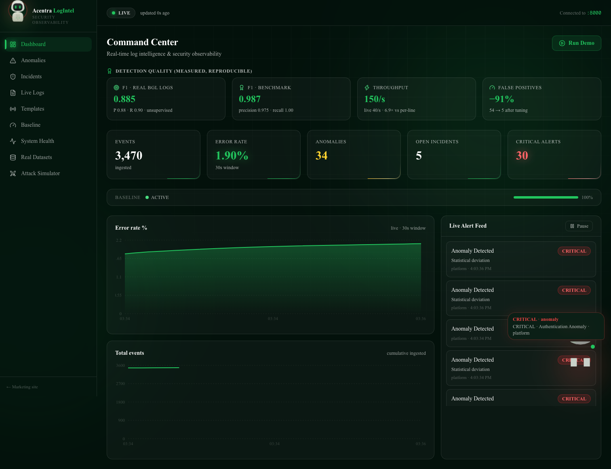
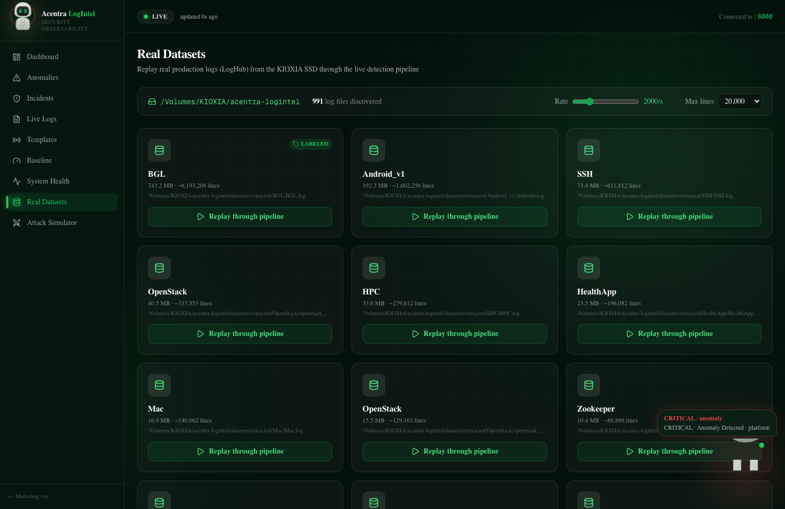
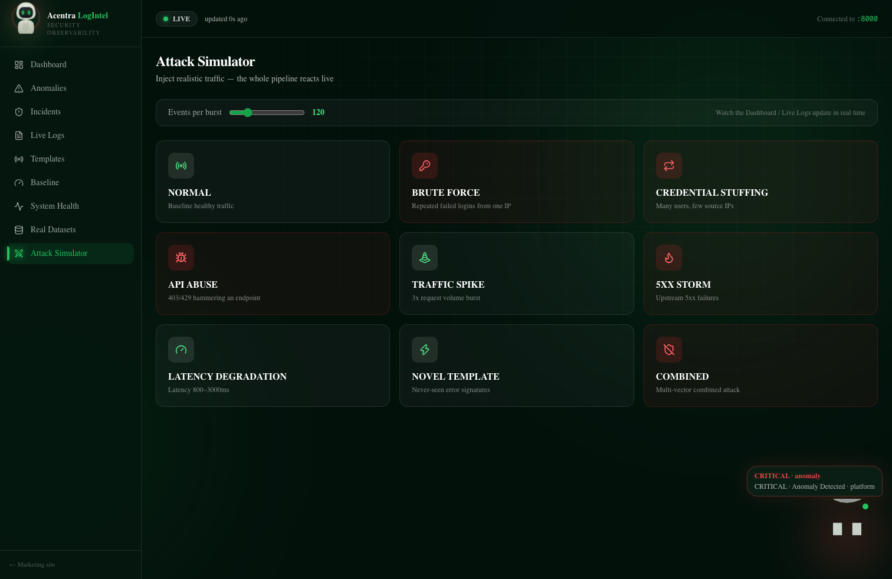
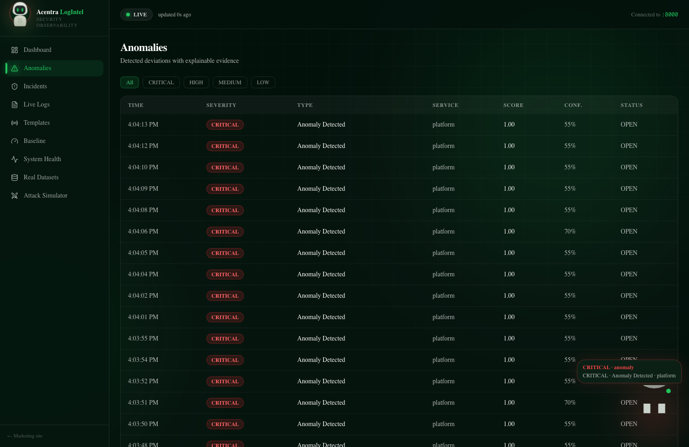
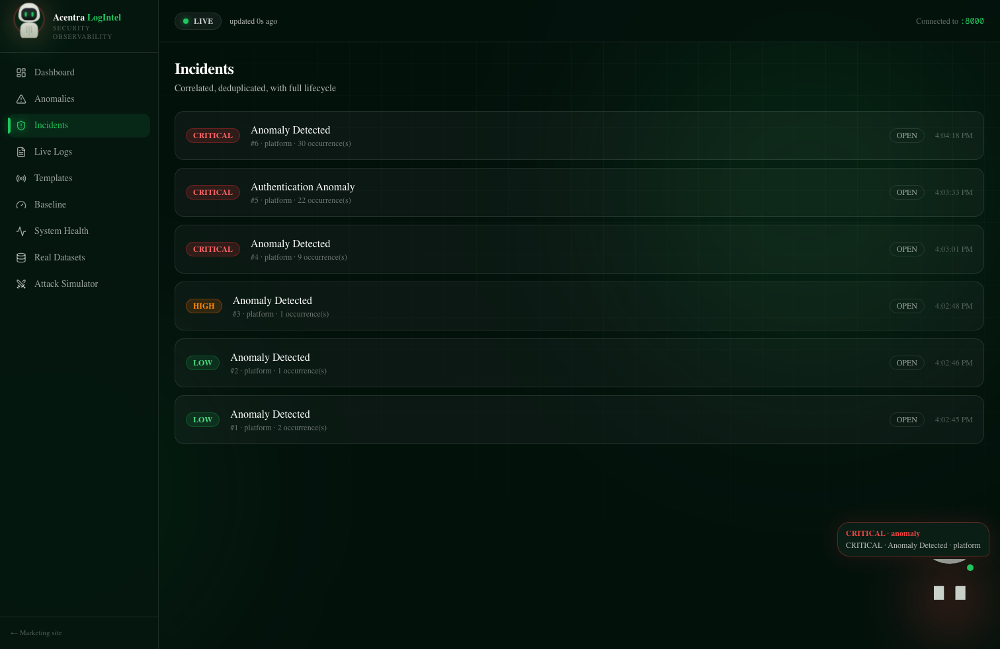
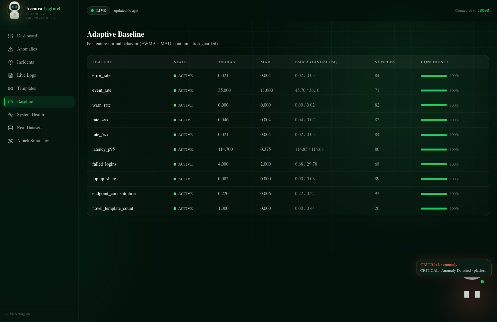
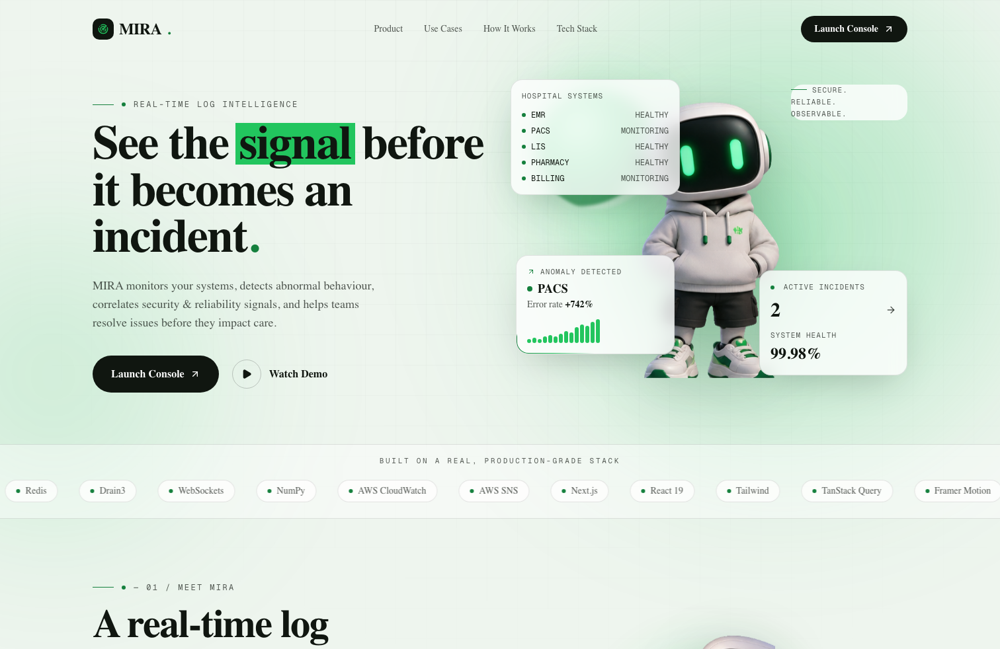

<div align="center">

# 🛰️ MIRA — Real-Time Log Intelligence & Security Observability

### *See the signal before it becomes an incident.*

MIRA ingests live log streams, mines templates online, learns an **adaptive baseline** of normal behaviour, and fuses statistical, template, and security detectors into **explainable, correlated incidents** — streamed to a real-time console. Built for healthcare-grade infrastructure (EMR, PACS, LIS, Pharmacy, Billing), it works for any system that emits logs.

### 🌐 [**▶ Live Demo — sacramento-snowy-eight.vercel.app**](https://sacramento-snowy-eight.vercel.app)

[](https://sacramento-snowy-eight.vercel.app)

> Frontend on Vercel, backend tunnelled from the live environment (keeps the KIOXIA dataset replay, PostgreSQL, Redis, and AWS all real). Best viewed while the backend is running.


</div>



---

## 📊 Measured Results

Not marketing numbers — reproducible outputs of the committed benchmark scripts.

| Metric | Result | How |
|---|---|---|
| **F1 — real BGL production logs** | **0.885** (P 0.875 · R 0.896) | `scripts/evaluate_detectors.py` — 400K lines, unsupervised, never trained on labels |
| **F1 — controlled benchmark** | **0.987** (precision 0.975, recall 1.000) | `scripts/accuracy_bench.py` |
| **False-positive reduction** | **−91%** (54 → 5) | effect-size gate tuning |
| **Throughput** | **2,688 events/sec** (6.9× faster) | batched writes vs per-line commits |

> These numbers are surfaced **live in the console** on the Detection Quality panel.

---

## ✨ Highlights

- **Adaptive baseline** — per-feature EWMA + robust MAD statistics, contamination-guarded (anomalies don't redefine "normal"), with fast/slow drift handling and a warm-up gate.
- **Multi-signal detection** — robust Z-score, **CUSUM** change-point (slow drift), template-frequency & novel-template detection, plus a **security rule engine** (brute-force, credential-stuffing, API abuse, injection/traversal signals).
- **Effect-size gate** — a feature must clear a real absolute/relative change floor, not just a big σ — the tuning that cut false positives 91%.
- **Explainable alerts** — every anomaly answers *what · why · how much · where · evidence*, never "confirmed attack".
- **Incident correlation** — fingerprint dedup + time/service correlation so 500 alerts become **one incident, 500 occurrences**, with a full lifecycle (DETECTED → OPEN → ACKNOWLEDGED → INVESTIGATING → RESOLVED).
- **Real datasets** — replays the full **LogHub** collection (BGL, HDFS, OpenStack, …) from an external **KIOXIA SSD** through the live pipeline.
- **Real-time everything** — Redis event bus → WebSocket fan-out with backpressure; sub-second to the dashboard.
- **Attack simulator** — nine realistic scenarios drive the live pipeline for demos and testing.
- **AWS fan-out** — CloudWatch Logs (every detection) + SNS (one alert per new incident), with graceful degradation.
- **Polished console + marketing site** — dark-green operations UI with an interactive 3D mascot (MIRA) that reacts to live events.

---

## 🖼️ Screenshots

| Command Center | Real Datasets (KIOXIA) |
|---|---|
|  |  |

| Attack Simulator | Anomalies |
|---|---|
|  |  |

| Incidents | Adaptive Baseline |
|---|---|
|  |  |

<div align="center">

**Marketing landing**



</div>

---

## 🏗️ Architecture

```
Log source ─┬─ synthetic attack simulator (9 scenarios)
            ├─ real dataset replay (LogHub on KIOXIA SSD)
            └─ growing-file tail (rotation-safe)
      │
      ▼
  Normalize → Drain3 templates → multi-scale time windows → feature engine (15+ features)
      → adaptive baseline (EWMA fast/slow + MAD, contamination-guarded, warm-up gate)
      → detector bank: robust-Z · CUSUM · novel-template · security rules
      → fusion (weighted, corroboration-aware) → explainable alert
      → incident manager (dedup · correlate · lifecycle)
      ▼
  ┌── PostgreSQL (7 tables)   ┌── Redis event bus → WebSocket → Console
  └── AWS CloudWatch + SNS ───┘
```

**Backend** — a clean modular monolith (`backend/app/`): `ingestion`, `normalization`, `parsing`, `features`, `detection`, `security`, `incidents`, `alerts`, `websocket`, `storage`, `aws`, `simulator`, `metrics`.

**Frontend** — Next.js App Router: a marketing landing (`/`) plus a live console (`/dashboard`, `/anomalies`, `/incidents`, `/logs`, `/templates`, `/baseline`, `/system`, `/datasets`, `/simulator`) wired to the backend via REST (TanStack Query) + a WebSocket live store.

---

## 🧰 Tech Stack

| Layer | Tech |
|---|---|
| Backend | Python 3.14, FastAPI, Uvicorn, asyncio, Pydantic v2 |
| Data & state | PostgreSQL (SQLModel), Redis, Drain3, NumPy |
| Detection | EWMA, robust Z / MAD, CUSUM, template novelty, security rules |
| Realtime | WebSockets, Redis pub/sub, in-process event bus, backpressure |
| Cloud & storage | AWS CloudWatch Logs + SNS, KIOXIA 1 TB external SSD (datasets) |
| Frontend | Next.js 16, React 19, Tailwind v4, TanStack Query, Framer Motion, React-Three-Fiber |

---

## 🚀 Quickstart

**Prerequisites:** Python 3.14+ (via [uv](https://docs.astral.sh/uv/)), Node 20+, running PostgreSQL and Redis.

```bash
# 1) Backend
cd backend
createdb logintel                       # once
uv sync
uv run uvicorn app.main:app --port 8000 # → http://localhost:8000

# 2) Frontend (new terminal)
npm install
PORT=3005 npm run dev                    # → http://localhost:3005
```

Open **http://localhost:3005**, click **Launch Console** → **Attack Simulator** → fire a scenario, or hit **Run Demo** on the dashboard for a scripted normal → attack → incident → recovery timeline.

### Real datasets (optional)

```bash
cd backend
python3 scripts/download_datasets.py     # LogHub → KIOXIA SSD (md5-verified, resumable)
uv run python scripts/evaluate_detectors.py \
  --path /Volumes/KIOXIA/acentra-logintel/datasets/extracted/BGL/BGL.log
```
Then browse **/datasets** in the console and click **Replay through pipeline**.

### Configuration

Backend settings are env vars prefixed `LOGINTEL_` (see `backend/app/config/settings.py`). AWS credentials load from a gitignored `backend/.env`:

```ini
LOGINTEL_AWS_ENABLED=true
LOGINTEL_AWS_REGION=us-east-1
AWS_ACCESS_KEY_ID=...
AWS_SECRET_ACCESS_KEY=...
LOGINTEL_SNS_TOPIC_ARN=arn:aws:sns:us-east-1:<acct>:logintel-alerts
```
AWS is optional and degrades gracefully when credentials are absent.

---

## 🔌 API

REST (14 endpoints) + WebSocket. Highlights:

| Endpoint | Purpose |
|---|---|
| `GET /api/stats` | live counters (events, error rate, anomalies, incidents) |
| `GET /api/anomalies` · `/incidents` · `/logs` · `/templates` · `/baseline` | console data |
| `GET /api/metrics/quality` | measured F1 / throughput / accuracy |
| `GET /api/datasets` · `POST /api/replay` | KIOXIA dataset browse + replay |
| `POST /api/simulate` · `POST /api/demo/start` | attack scenarios + scripted demo |
| `WS /ws/events` | `log_event · anomaly_detected · incident_* · baseline_updated · system_status` |

---

## 🔬 Research Grounding

Techniques are labelled **research fact** vs **engineering decision** vs **heuristic** throughout the code. Baselines use EWMA and the Iglewicz–Hoaglin modified z-score (MAD); change-point detection uses Page's tabular CUSUM; template mining uses Drain3. Thresholds and fusion weights are configurable heuristics, not presented as scientifically optimal. Security signals are deliberately phrased as *possible*, never *confirmed*.

---

## 👥 Team

| Member | Role | Key Contributions |
|---|---|---|
| **Shanu Kumar** | Team Lead · Research | Project leadership & technical direction · problem & system research · detection approach · overall coordination |
| **Anish Mall** | Cloud Services | Cloud architecture · AWS integrations · deployment & CI/CD · infrastructure setup |
| **Devansh Goenka** | Backend | Python backend · log ingestion pipeline · detection engine & APIs · database design |
| **Sourav Kumar** | Frontend | MIRA web console · real-time visualizations · UI/UX design & development · frontend–API integration |
| **Ambesh Singh** | Presentation | Pitch deck design · visual communication · demo flow & storytelling · content structuring |

---

## 📄 License & Disclaimer

Copyright © 2026 the MIRA team. Private repository — all rights reserved.

This is a hackathon prototype. Stats and testimonials on the landing page are realistic placeholders; the project is brand-*themed* and **not affiliated with Acentra Health**.
