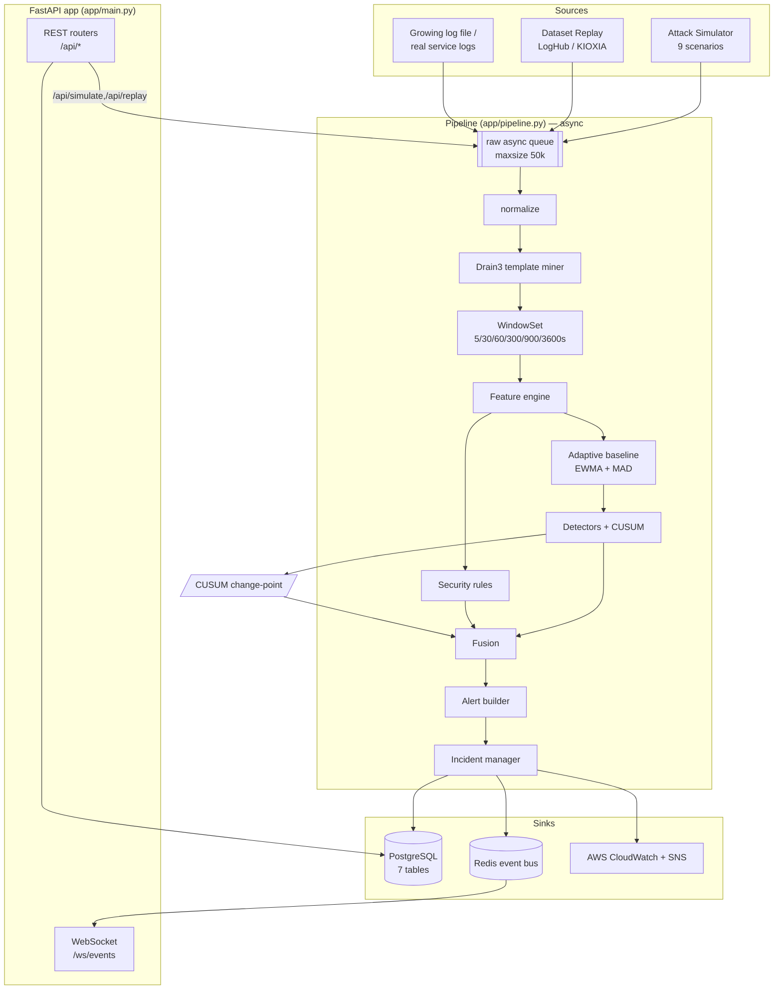
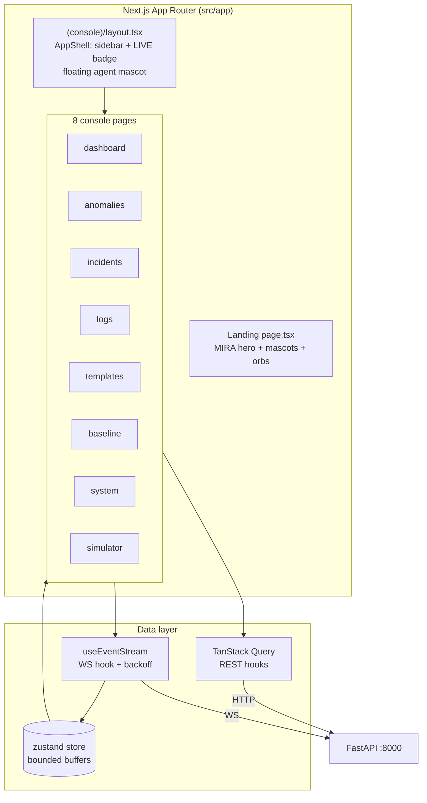
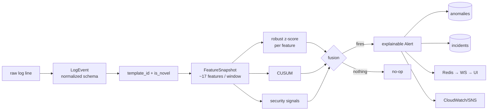
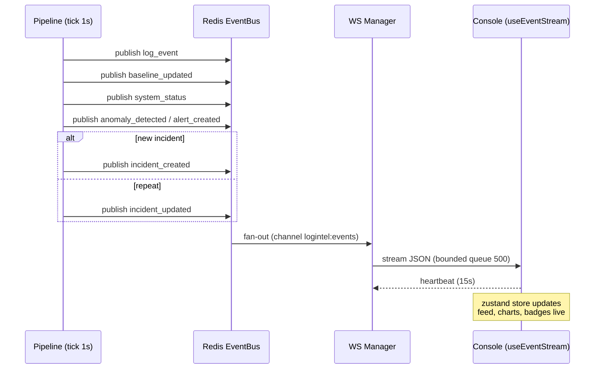
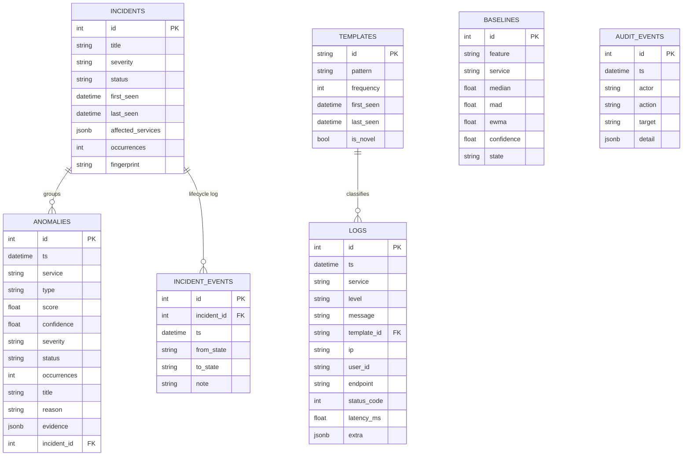
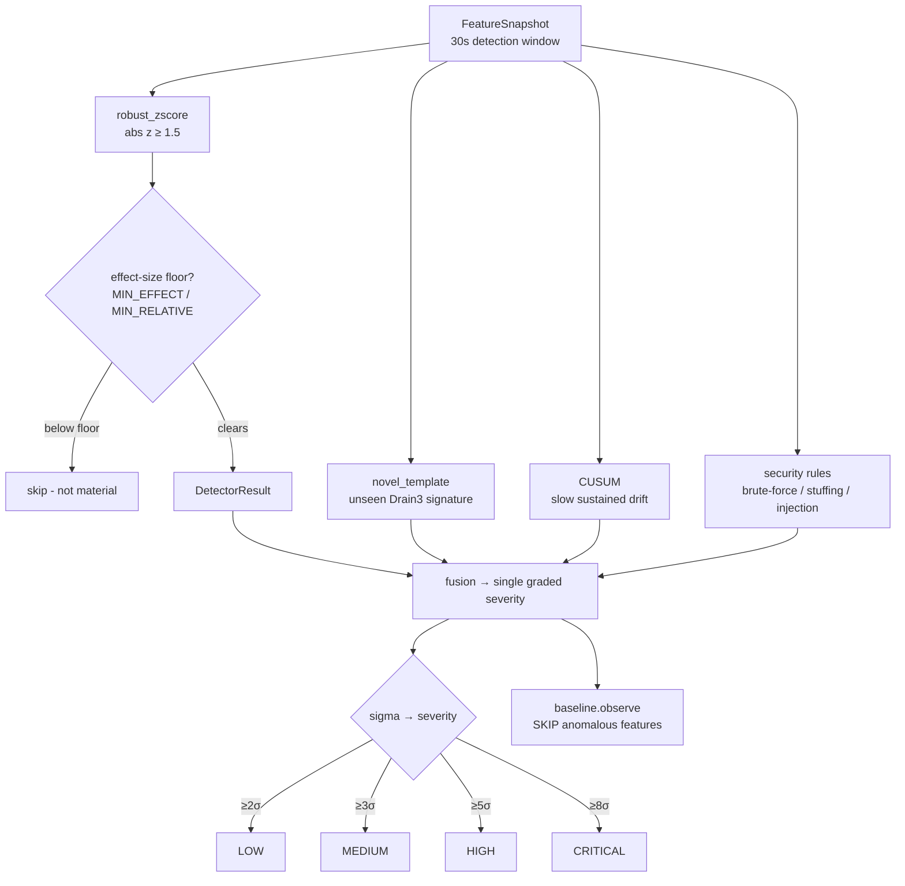
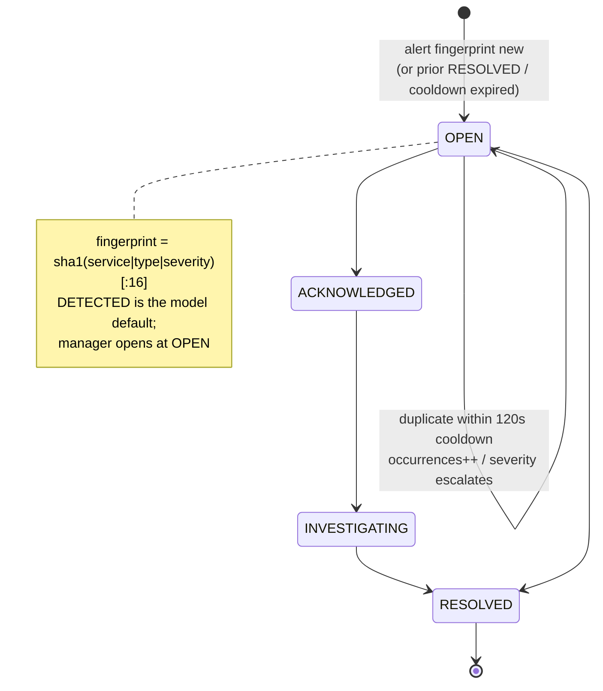
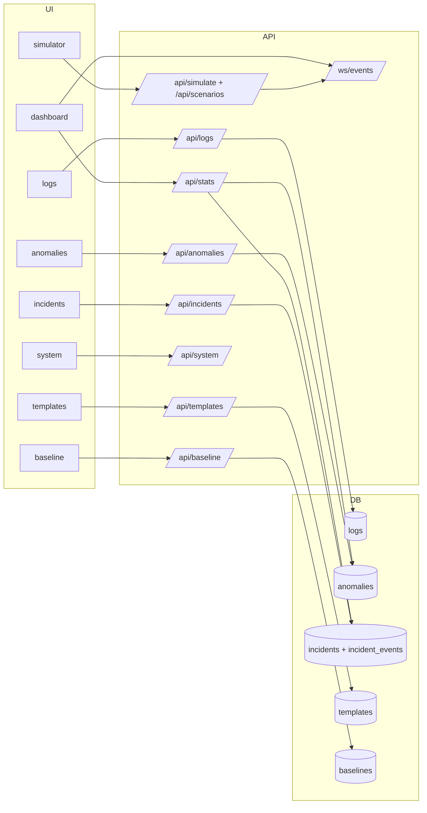
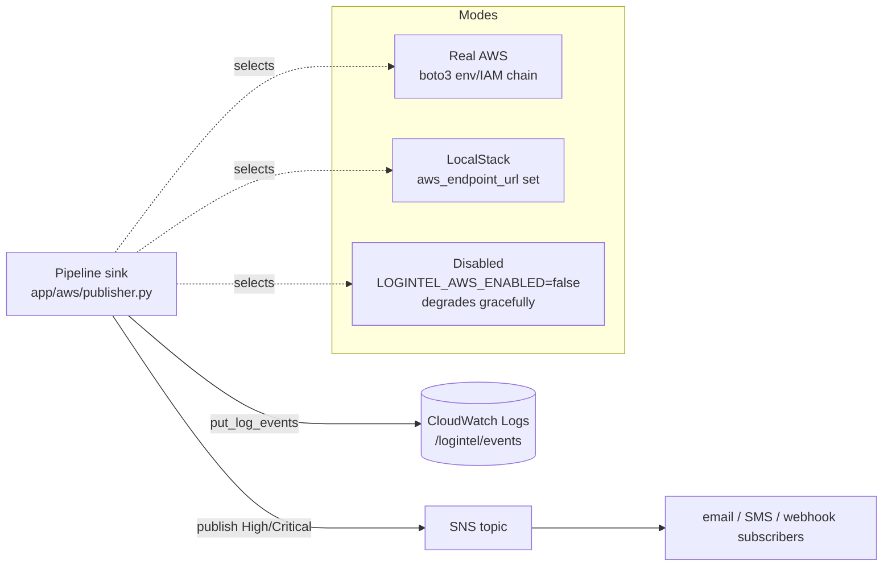
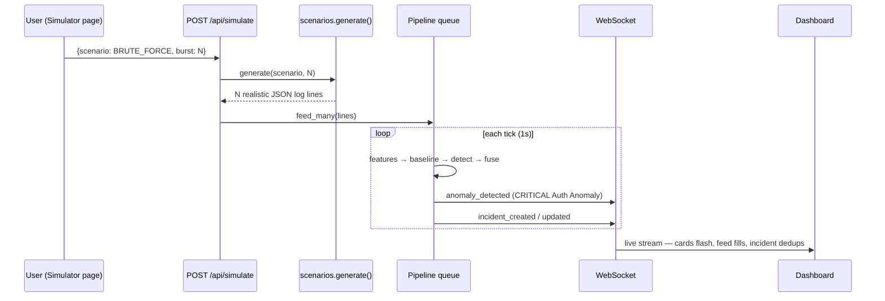

# MIRA — Medical Infrastructure Reliability & Anomaly platform

**Real-time log anomaly detection for hospital / public-sector health infrastructure.**
Acentra Health–themed prototype. Sees the *signal* before it becomes an *incident*.

> One line: MIRA watches every log your systems produce, **learns what "normal" looks like on its own**, and raises graded, explainable alerts the moment behavior drifts — streamed live to a console, correlated into incidents, and (optionally) pushed to AWS.

---

## 1. The Product — what it is & why it wins

Most anomaly systems hardcode a threshold (`if error_rate > 0.2: alert`). MIRA does not. Its differentiator is an **adaptive, self-learning baseline** (EWMA + median/MAD robust z-score, per feature, with warm-up gating and contamination guards). It resists spike-poisoning, adapts to changing traffic, and every alert ships with a **human-readable reason and evidence** — never "confirmed attack", always honest "possible" signals.

**Positioning:** "Statistical baseline for speed + graded, explainable detection — like Datadog Watchdog, built for hospital infrastructure (PACS, EHR, lab, pharmacy, scheduling, gateways)."

**What makes it demo-winning:**
- Adaptive baseline, **not** a hardcoded threshold
- **Time-based** sliding windows (not count-based) across 6 horizons
- Cold-start / warm-up gating (never alerts while still learning)
- **Graded severity** LOW / MEDIUM / HIGH / CRITICAL with an explanation string
- Security signals are **evidence-grounded and honest** ("possible brute-force"), never overclaimed
- Real production log datasets (LogHub) can be **replayed live** through the exact same pipeline
- A polished, **on-brand animated UI** (mouse-tracking MIRA mascots, orbs, motion, border-beams)

---

## 2. System Overview (bird's eye)

```
        ┌──────────────── SOURCES ────────────────┐
        │  Attack Simulator (9 scenarios)          │
        │  LogHub dataset replay (KIOXIA SSD)      │──▶ raw log lines
        │  Growing log file / real service logs    │
        └──────────────────────────────────────────┘
                              │
                              ▼
   ┌──────────────────────  BACKEND PIPELINE (FastAPI, async)  ──────────────────────┐
   │ ingest → normalize → Drain3 template mine → multi-window features                │
   │   → adaptive baseline (EWMA + MAD) → detectors + security rules → fusion         │
   │   → explainable alert → incident dedup/correlate/lifecycle                       │
   └──────────────┬───────────────────────┬───────────────────────┬──────────────────┘
                  ▼                        ▼                        ▼
             PostgreSQL              Redis event bus            AWS (optional)
           (7 tables)          → WebSocket fan-out          CloudWatch + SNS
                                        │
                                        ▼
                          Next.js console (8 pages)  ──  live, every number real
```

**Two processes at runtime:**
- **Backend** — `http://localhost:8000` (FastAPI + uvicorn, Postgres, Redis)
- **Frontend** — `http://localhost:3005` (Next.js: MIRA landing + connected console)

---

## 3. The Detection Pipeline (end to end)

`backend/app/pipeline.py` is the beating heart. Every second (`tick_interval_s = 1.0`):

1. **Ingest** — raw lines land on an async queue (`maxsize=50000`) from any source.
2. **Normalize** (`normalization/`) — parse into a typed `LogEvent`: `timestamp, service, host, level, message, template_id, parameters, ip, user_id, endpoint, status_code, latency_ms, metadata`.
3. **Template mining** (`parsing/template_miner.py`) — **Drain3** collapses each message into a template ID; brand-new templates are flagged `is_novel`.
4. **Windows** (`features/windows.py`) — events fan into **6 time-based windows**: `5, 30, 60, 300, 900, 3600` seconds.
5. **Feature engine** (`features/engine.py`) — computes a `FeatureSnapshot` per tick (the real "data" detectors reason over — see §4).
6. **Detectors** (run against the 30s detection window):
   - `robust_zscore` — median/MAD z-score per monitored feature, gated by a **minimum effect size** (§5) so a trivial `0.048→0.052` never fakes "10σ".
   - `novel_template` — an unseen Drain3 signature = anomaly.
   - **CUSUM** (`detection/cusum.py`) — Page's tabular change-point detector, catches slow sustained drift the window misses.
   - **Security rules** (`security/rules.py`) — brute-force, credential-stuffing, SQL/command-injection *signals* (honest "possible", never "confirmed").
7. **Baseline update** — happens **after** detection, **skipping anomalous features** so the spike you just caught can't poison the baseline.
8. **Fusion** (`detection/fusion.py`) — combines detector scores + signals into a single graded severity; returns `None` if nothing fires.
9. **Alert builder** (`alerts/builder.py`) — produces the explainable alert: `title, reason, assessment, score, confidence, peak_sigma, contributing, evidence`.
10. **Incident manager** (`incidents/manager.py`) — dedup / correlate / lifecycle state machine (OPEN → … → RESOLVED), increments `occurrences` on repeats.
11. **Sinks** — PostgreSQL (persist) + Redis bus → WebSocket (`/ws/events`) + AWS (CloudWatch `put_log_events`, SNS `publish` for High/Critical).

---

## 4. Features extracted per window (`features/engine.py`)

Each `FeatureSnapshot` computes:

- **Volume / errors:** `event_rate`, `error_rate`, `warn_rate`
- **HTTP mix:** `rate_2xx`, `rate_3xx`, `rate_4xx`, `rate_5xx`
- **Latency:** `latency_p50`, `latency_p95`, `latency_p99`
- **Identity / spread:** `unique_ips`, `unique_users`, `top_ip_share`, `endpoint_concentration`
- **Security:** `failed_logins`
- **Novelty / diversity:** `template_entropy`, `novel_template_count`

**Monitored statistically** (the subset detectors watch): `error_rate, event_rate, warn_rate, rate_4xx, rate_5xx, latency_p95, failed_logins, top_ip_share, endpoint_concentration, novel_template_count`.

---

## 5. Why the numbers are credible (tuning that wins points)

Severity thresholds (robust-z sigma, configurable heuristics): `LOW 2σ · MEDIUM 3σ · HIGH 5σ · CRITICAL 8σ`.

**Minimum effect-size floors** (a feature must clear an *absolute* or *relative* change before it can fire, regardless of sigma):
`error_rate +5pp · rate_5xx +3pp · rate_4xx/warn +8pp · failed_logins +5 · latency_p95 +50ms · top_ip_share/endpoint_concentration +0.20 · novel_template +1 · event_rate ±50% relative`.

This is the precision guard that stops a tiny MAD from manufacturing meaningless "400σ" alerts on a freshly-booted, idle baseline.

---

## 6. Data Sources & Datasets

**You need NO external ML training dataset.** MIRA is an *online/streaming* system — the baseline learns "normal" live from your own traffic.

Three practical sources, all through one `LogSource` interface (`ingestion/base.py`):

| Source | Use |
|---|---|
| **Attack simulator** (`simulator/scenarios.py`) | Primary demo driver — 9 realistic scenarios on demand |
| **Dataset replay** (`ingestion/dataset_replay.py`) | Streams real **LogHub** files off the KIOXIA SSD at a controlled rate |
| **Growing log file / real service logs** | Rotation-safe tailer / any structured lines |

**9 simulator scenarios:** `NORMAL, BRUTE_FORCE, CREDENTIAL_STUFFING, API_ABUSE, TRAFFIC_SPIKE, 5XX_STORM, LATENCY_DEGRADATION, NOVEL_TEMPLATE, COMBINED`.

**Real datasets (LogHub / Zenodo, ~6 GB) on the KIOXIA external SSD** at `/Volumes/KIOXIA/acentra-logintel/datasets/` — the system auto-falls back to `backend/.data/` if the SSD is unplugged (never crashes). Landed & usable: Zookeeper, SSH, OpenStack, HPC, Hadoop, Mac, HealthApp, Linux, Apache, Proxifier, Android. Big labeled benchmarks (BGL, HDFS, Spark, Windows, Thunderbird) stream in the background; **HDFS_v1 / BGL / OpenStack** carry ground-truth labels used by the eval harness (`scripts/evaluate_detectors.py`) for precision/recall/F1.

Optional GPU deep-model layer (stretch goal): DeepLog / LogBERT semantic anomalies, guarded by `torch.cuda.is_available()` with CPU fallback.

---

## 7. Tech Stack

- **Backend:** Python 3.14, FastAPI + uvicorn, `asyncio`, SQLModel, numpy, **Drain3**, boto3, pydantic-settings
- **Data / state:** PostgreSQL (persistence), Redis (event bus / WS fan-out)
- **Realtime:** WebSocket `/ws/events` with heartbeat + bounded client queues
- **Cloud (optional):** AWS CloudWatch Logs + SNS via boto3; **LocalStack** for offline; degrades gracefully when creds are absent
- **Frontend:** Next.js (App Router) + React 19 + TypeScript + Tailwind v4, TanStack Query (REST) + a `useEventStream` WS hook → zustand store; Magic UI / Aceternity / shadcn components, Framer Motion, custom SVG MIRA mascot
- **Storage:** KIOXIA external SSD for datasets & heavy artifacts

---

## 8. Database (PostgreSQL — 7 tables)

`logs`, `templates`, `baselines`, `anomalies`, `incidents`, `incident_events`, `audit_events`.

Writes are **batched per tick** in one transaction for throughput; templates are upserted; log rows persisted (sampled at high rate). Repositories in `storage/repositories.py`.

---

## 9. API & WebSocket

**REST (`/api`, FastAPI):** `GET /health`, `/api/stats`, `/api/anomalies` (+`/{id}`), `/api/incidents` (+`/{id}`, + state transition), `/api/logs`, `/api/templates`, `/api/baseline`, `/api/system`, `/api/datasets`, `POST /api/replay`, `POST /api/simulate`, `GET /api/scenarios`.

**WebSocket `/ws/events`** emits: `log_event`, `baseline_updated`, `system_status`, `anomaly_detected`, `alert_created`, `incident_created`, `incident_updated`.

`/api/stats` returns the dashboard's source of truth: `events, error_rate, event_rate, anomalies, open_incidents, critical_alerts, baseline_state, baseline_confidence, latency_p95`.

---

## 10. The UI (Next.js — landing + 8 console pages)

**MIRA landing** (`src/app/page.tsx`) — Acentra Health green identity: hero ("See the signal before it becomes an incident") with mouse-tracking mascot + orb + parallax live status cards, tech-stack marquee, "Meet MIRA", the real 8-stage **How It Works** pipeline, capabilities, 6 hospital use-cases, animated counters, CTA.

**Console** (`src/app/(console)/`) — shared AppShell (sidebar mascot + LIVE badge + floating cursor-tracking AI-agent mascot that pops "⚠ Signal detected" bubbles), 8 pages:
`dashboard` · `anomalies` (+evidence drawer) · `incidents` (+lifecycle timeline) · `logs` (live, pause/resume) · `templates` (Drain3) · `baseline` (per-feature EWMA/MAD) · `system` (health) · `simulator` (9 scenario cards + burst slider).

Every number is **real** (REST + WS) — no fake data outside explicit demo mode.

---

## 11. How to run

```bash
# Backend (Postgres + Redis running)
cd backend && LOGINTEL_AWS_ENABLED=false uv run uvicorn app.main:app --port 8000

# Frontend
PORT=3005 npm run start        # or: npm run dev
# → http://localhost:3005  (landing → "Launch Console" → /dashboard)
```

Open `/simulator`, fire **Combined attack**, watch the dashboard, logs, and incidents light up live.

---

## 12. Demo script (the win)

1. Calm green feed — "baseline is learning… now ACTIVE, confidence 100%."
2. Fire `BRUTE_FORCE` (or Combined) from the simulator → error rate jumps.
3. Dashboard flashes **CRITICAL "Authentication Anomaly"**, assessment *"Possible brute-force activity"*, fused from multiple detectors, `4.1σ above baseline`.
4. Alerts dedup into a **single incident** (occurrences count up).
5. (With AWS) show the same alert landing in CloudWatch Logs + SNS (LocalStack).
6. Replay a **real LogHub dataset** off KIOXIA through the same pipeline for credibility.

---

## 13. Status & honest notes

**✅ Built & verified:** full backend pipeline (~25 modules, end-to-end brute-force → CRITICAL → deduped incident); 11 REST endpoints + `WS /ws/events`; connected 8-page console + landing; KIOXIA dataset replay (`/api/datasets`, `/api/replay`); CUSUM detector; labeled eval harness.

**🔜 Remaining / caveats:**
- **AWS DISABLED** here (no creds) — wired via boto3, activates with creds or LocalStack.
- **Detection tuning** — a fresh idle boot learns baseline "0" → inflated σ; effect-size floors help, but continuous warm-up traffic makes numbers read most credibly.
- **Demo Mode** deterministic timeline + an optional **LLM "judging agent"** (evidence-grounded plain-English assessment) are planned enhancements.
- Charts fill from live WS ticks over a few seconds; a headless screenshot may catch them empty (they render in a real browser).
- Landing stats/testimonials are realistic **placeholders**; this is a brand-*themed* demo, **not affiliated with Acentra Health**.

---

# 14. Architecture Diagrams

All diagrams are Mermaid — they render in GitHub, VS Code, and most Markdown viewers.

## 14.1 Backend Architecture



## 14.2 Frontend Architecture



## 14.3 Data-Flow Diagram



## 14.4 WebSocket Event Architecture



## 14.5 Database ER Design



## 14.6 Detection Pipeline



## 14.7 Incident Lifecycle



## 14.8 UI → API → Database Mapping



## 14.9 AWS Architecture



## 14.10 Attack Simulation Flow



</content>
</invoke>
